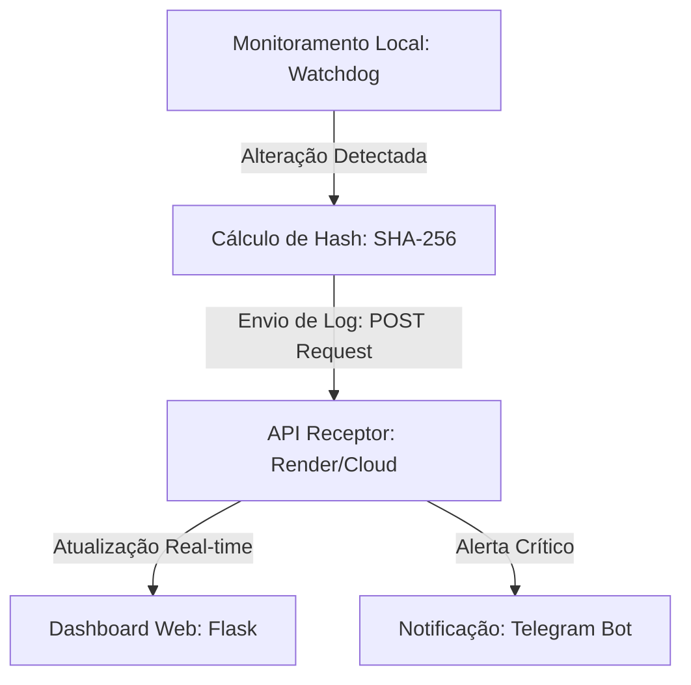

# 🛡️ SOC File Integrity Monitor (FIM) & Hybrid Dashboard


Este projeto simula uma operação real de um **SOC (Security Operations Center)** focado em **Monitoramento de Integridade de Arquivos (FIM)**. A solução utiliza Python para detectar alterações em ativos críticos, valida a integridade via criptografia (Hashes SHA-256) e centraliza os eventos em um Dashboard na nuvem com alertas integrados via Telegram.

## 📋 Arquitetura do Sistema

O projeto utiliza uma arquitetura híbrida que separa a detecção (Agente Local) da visualização e alerta (Cloud):



1. **Monitoramento de Baixo Nível:** Utiliza a biblioteca `watchdog` para interagir com as APIs nativas do sistema operacional (Windows), monitorando eventos de criação, modificação e deleção de arquivos em tempo real.
2. **Análise de Integridade (SHA-256):** Implementa verificações de hash para garantir que o conteúdo dos arquivos não foi adulterado, eliminando falsos positivos.
3. **Comunicação Híbrida (Agente -> Cloud):** O agente local envia pacotes de dados via requisições `POST` para uma API Flask hospedada no **Render**, simulando o comportamento de um EDR/SIEM enviando logs para um console central.
4. **Resposta e Visibilidade:** O servidor centralizado processa as requisições, popula o **Dashboard Web** em tempo real e dispara notificações críticas via **Telegram Bot API**.

## 🚀 Tecnologias Utilizadas

* **Linguagem:** Python 3.x
* **Framework Web:** Flask (Dashboard & API Receptor)
* **Monitoramento:** Watchdog (Eventos de Sistema de Arquivos)
* **Segurança:** Hashlib (SHA-256) e Python-dotenv (Gestão de Variáveis de Ambiente)
* **Comunicação:** Requests (Integração de APIs e Webhooks)

## 📂 Estrutura do Repositório

* `app.py`: Servidor centralizado e Dashboard hospedado no Render.
* `attack_sim.py`: Script de Red Team/Simulação que dispara alertas para a nuvem.
* `templates/index.html`: Interface do analista SOC para monitoramento visual.
* `.env`: Configurações sensíveis (Tokens de API e IDs de Chat) — *Nunca enviado ao Git*.
* `soc_audit.log`: Registro persistente para análise forense posterior.

## 🛠️ Como Executar

1. **Configuração do Ambiente:**

```bash
python -m venv .venv
# Windows:
.venv\Scripts\activate
pip install -r requirements.txt

```

2. **Variáveis de Ambiente:**
Configure o arquivo `.env` com suas credenciais do Telegram. No **Render**, configure estas chaves na aba *Environment Variables*.
3. **Inicialização:**
Execute o servidor central (ou acesse seu link do Render):

```bash
python app.py

```

4. **Simulação de Incidente:**
Em um terminal local, execute o simulador para disparar alertas para a nuvem:

```bash
python attack_sim.py

```

## 🛡️ Habilidades Demonstradas

Este projeto reflete competências essenciais para **Engenharia de Redes e Segurança**:

* **Sistemas Distribuídos:** Comunicação segura entre processos locais e nuvem.
* **Defesa Ativa:** Implementação de controles de monitoramento de integridade (FIM).
* **Automação de Resposta:** Redução do tempo de detecção e resposta (MTTD/MTTR) através de alertas automatizados no Telegram.
* **Visibilidade de Operações (NOC/SOC):** Criação de dashboards para gestão de incidentes.

Confira: https://soc-monitor.onrender.com
