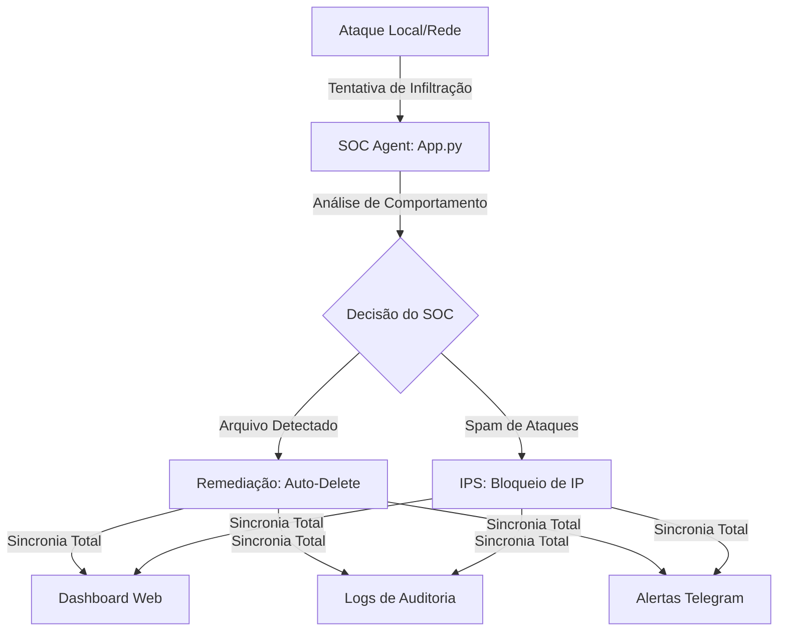

# 🛡️ SOC Active Response System (FIM & IPS)

Este projeto simula uma operação real de um **SOC (Security Operations Center)** de alta performance. Diferente de monitores passivos, esta solução implementa **Resposta Ativa**, combinando Monitoramento de Integridade de Arquivos (FIM) com um Sistema de Prevenção de Intrusão (IPS) capaz de expulsar atacantes em tempo real.

## 📋 Novas Funcionalidades (v3.0)

Além do monitoramento básico, o sistema agora conta com:
1. **Resposta Ativa (Remediação):** O SOC detecta a criação de arquivos maliciosos e executa a exclusão automática (expulsão) do artefato em milissegundos.
2. **IPS & Firewall Inteligente:** Monitoramento de requisições na API. Se um IP realizar mais de 3 tentativas de ataque, o sistema realiza o **banimento automático do IP** via Firewall de aplicação.
3. **Dashboard de Auditoria com Abas:** Interface limpa que separa Alertas Críticos de Logs de Auditoria detalhados.
4. **Silenciamento de Ruído:** Logs de sistema (requisições GET 200) são filtrados, mantendo apenas evidências de segurança para análise forense.

## 📋 Arquitetura do Sistema

## 🛠️ Resposta Ativa e Prevenção

### Proteção de Camada de Rede (Firewall)

O sistema monitora o comportamento de cada IP. Ao atingir o limiar de segurança, o acesso é negado com erro `403 Forbidden`.

* **Desbloqueio Manual:** Para fins de teste, o administrador pode resetar as regras de firewall acessando diretamente o link:
`https://soc-monitor.onrender.com/api/reset_firewall`

### Monitoramento de Baixo Nível (FIM)

* **Auto-Expulsão:** Utiliza o evento `on_created` para neutralizar ameaças no momento em que tocam o disco rígido.

## 🚀 Tecnologias Utilizadas

* **Linguagem:** Python 3.x
* **Framework Web:** Flask (Dashboard & IPS Engine)
* **Monitoramento:** Watchdog (Resposta Ativa em arquivos)
* **Logging:** Silenciamento de logs Werkzeug para auditoria limpa (Clean Logs)
* **Comunicação:** Requests (Webhooks Telegram)

## 📂 Estrutura Atualizada

* `app.py`: O "Cérebro" do SOC. Gerencia o Firewall, a API e a Resposta Ativa.
* `attack_sim.py`: Script agressivo que simula infiltração de arquivos e ataques de rede coordenados.
* `templates/index.html`: Dashboard profissional com sistema de abas (Alertas vs Logs).
* `soc_audit.log`: Arquivo de auditoria contendo apenas incidentes reais (sem ruído de sistema).

## 🛡️ Habilidades Demonstradas

* **Segurança Ativa (IPS):** Implementação de lógica de defesa que interrompe o ataque sem intervenção humana.
* **Observabilidade:** Gestão de logs de auditoria (SIEM style) focados em redução de ruído.
* **Orquestração de Resposta:** Sincronização de múltiplos canais de alerta (Web, Log, Chat) para uma única ameaça.

---

[Acesse o Dashboard Live](https://soc-monitor.onrender.com) | [Desbloquear meu IP](https://soc-monitor.onrender.com/api/reset_firewall)
